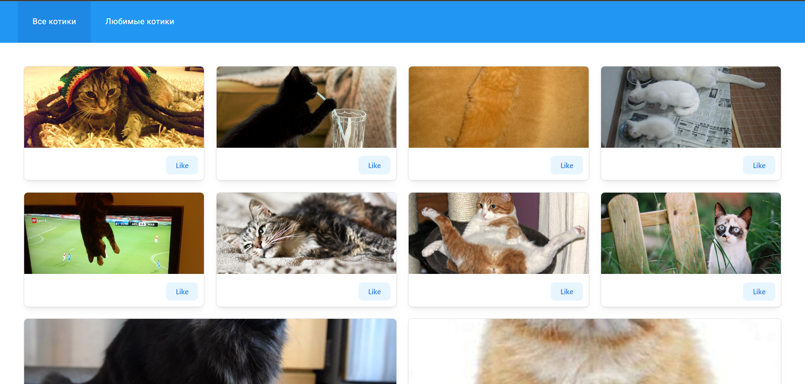

# Cat Pinterest

**You can also read this README in [English](https://github.com/klekwedge/cat-pinterest/blob/main/README.EN.md).**

## Оглавление

- [Инструкции по развертыванию](#инструкции-по-развертыванию)
- [Обзор](#обзор)
  - [Скриншот](#скриншот)
  - [Ссылки](#ссылки)
- [Мой процесс](#мой-процесс)
  - [Стек](#стек)
  - [Что я узнал](#что-я-узнал)
- [Автор](#автор)

## Инструкции по развертыванию

**Для запуска проекта на вашем компьютере должны быть установлены [npm](https://nodejs.org/en/) и [git](https://git-scm.com/downloads)**

1. Сделайте клон этого репозитория ```git clone https://github.com/klekwedge/cat-pinterest.git```
2. Установите все необходимые пакеты npm с помощью ```npm i```
3. Запустите проект командой ```npm run dev```

## Обзор

Необходимо реализовать интерфейс для просмотра котиков используя API https://thecatapi.com

Дизайн лежит тут - https://bit.ly/3utxaL2

- по умолчанию должна открываться вкладка "все котики"
- у котика должна быть возможность добавить в "любимые" и убрать из "любимых"
- данные о "любимых" котиках должны хранится на клиенте
- на вкладке "любимые котики" должны отображаться добавленные в "любимые" котики
- реализация адаптивности будет плюсом, но не обязательна
- бесконечная прокрутка будет плюсом, но не обязательна
- можно использовать любой фреймворк включая vanilla.js

### Скриншот



### Ссылки

- [Ссылка на проект](https://github.com/klekwedge/cat-pinterest)
- [Деплой](https://klekwedge-cat-pinterest.vercel.app/)

## Мой процесс

### Стек

- React
- TypeScript
- Redux Toolkit
- SCSS
- Mantine

### Что я узнал

## Автор

- [Вебсайт](https://klekwedge-cv.vercel.app/)
- [Linkedin](https://www.linkedin.com/in/klekwedge/)
- [Facebook](https://www.facebook.com/klekwedge)
